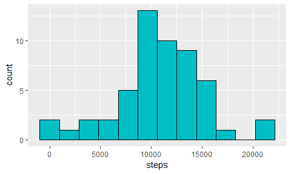
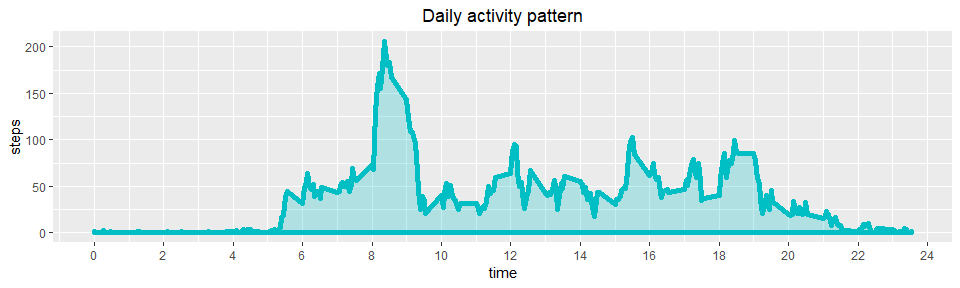
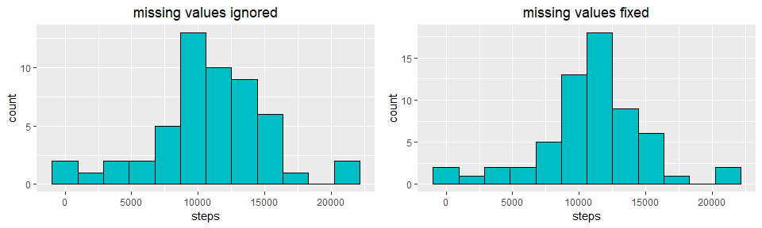
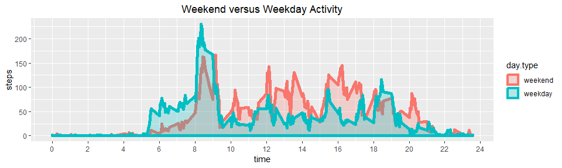

## Loading and preprocessing the data
We first download data from the original url in case data file doesn't exist in a working directory


```r
url <- "https://d396qusza40orc.cloudfront.net/repdata%2Fdata%2Factivity.zip"
filename <- "activity.zip"

if (!file.exists(filename))
    download.file(url, destfile = filename)
```

Then load data into R


```r
schema <- c("integer", "Date", "integer")

raw.data <- read.csv(
    unz(filename, "activity.csv"),
    header = TRUE, sep = ",", quote = "\"",
    colClasses = schema
)
```

## What is mean total number of steps taken per day?

Let's group our data and summarize it by date

```r
steps_per_day <- raw.data %>% group_by(date) %>% summarise(steps = sum(steps))
```

Now we can take take the distribution of steps by day and plot its histogram

```r
h1 <- ggplot(steps_per_day, aes(x=steps)) + 
    geom_histogram(bins = 12, color=1, fill="#00BFC4"); h1
```

<!-- -->

The mean and median of steps per day are:


```r
summary(steps_per_day$steps)[c("Mean","Median")]
```

```
##     Mean   Median 
## 10766.19 10765.00
```
## What is the average daily activity pattern?

Let's summarize our source data by interval across all days and plot average number of steps the person does during the day.


```r
steps_per_int <- raw.data %>% group_by(interval) %>% 
    summarise(steps = mean(steps, na.rm = TRUE))

ggplot(data = steps_per_int, aes(x = interval, y = steps)) +
    scale_x_continuous(breaks=0:12*200, labels=0:12*2) +
    labs(title = "Daily activity pattern", x="time") +
    geom_area(size=2, color="#00BFC4", fill="#00BFC4", alpha=.25)
```

<!-- -->

There's one peak value in the morning. Let's have a look at which time exactly this maximum is reached.


```r
steps_per_int[which.max(steps_per_int$steps),] %>% as.data.frame
```

```
##   interval    steps
## 1      835 206.1698
```
## Imputing missing values

Let's see how many missing values are there in the raw data set in each column.


```r
summarise_all(raw.data, ~sum(is.na(.)))
```

```
##   steps date interval
## 1  2304    0        0
```

There are 2304 missing values, all in the *steps* column. Let's fill them in. One possible strategy to imputing missing values is to substitute NAs by an average number of steps across all days taken for the respective time interval.


```r
data.fixed <- raw.data %>% left_join(steps_per_int, by="interval") %>%
    mutate(steps = ifelse(is.na(steps.x), steps.y, steps.x)) %>%
    select(date, interval, steps)
```

And check if any missing values remain


```r
sum(is.na(data.fixed$steps))
```

```
## [1] 0
```

Good. No NAs left. Let's check if histogram shape has changed. The code below counts total steps per day with missing values fixed, and plots the adjusted histogram next to the one we have seen earlier with missing values ignored.


```r
steps_per_day2 <- data.fixed %>% group_by(date) %>% summarise(steps = sum(steps))

h2 <- ggplot(steps_per_day2, aes(x=steps)) + 
    geom_histogram(bins = 12, color=1, fill="#00BFC4")

grid.arrange(h1+labs(title="missing values ignored"),
             h2+labs(title="missing values fixed"), ncol=2)
```

<!-- -->

The distribution shape seems to change a little, and become more symmetric and clustered about its mean. Let's check it. The below code shows how mean, median, and standard deviation changed after imputing missing values.


```r
cbind(rbind(summary(steps_per_day$steps)[c("Mean", "Median")],
            summary(steps_per_day2$steps)[c("Mean", "Median")]), 
      data.frame(SD = c(sd(steps_per_day$steps, na.rm = TRUE), sd(steps_per_day2$steps))))
```

```
##       Mean   Median       SD
## 1 10766.19 10765.00 4269.180
## 2 10766.19 10766.19 3974.391
```

We see that mean and median number of total steps per day has almost not changed at all. The standard deviation has decreased by about 7%, which confirms our guess regardign the more condensed histogram shape.

## Are there differences in activity patterns between weekdays and weekends?

The last thing we'll check is how weekday activity pattern differs from the weekend pattern.


```r
steps_by_daytype <- data.fixed %>%
    mutate(day.type = 
        factor(strftime(date, "%u")>5,lev=c(T,F), lab=c("weekend", "weekday"))) %>%
    group_by(day.type, interval) %>% 
    summarise(steps = mean(steps))

ggplot(steps_by_daytype, aes(x=interval, y=steps, color=day.type, fill=day.type)) +
    scale_x_continuous(breaks=0:12*200, labels=0:12*2) +
    labs(title = "Weekend versus Weekday Activity", x="time") +
    geom_area(size=2, alpha=.25, position="identity")
```

<!-- -->

The plot shows us difference in the two daily activity patterns: greater average weekday activity in the morning (from 5 to 9 am) and lower average weekday activity in the rest of the day compared to the weekend activity.
